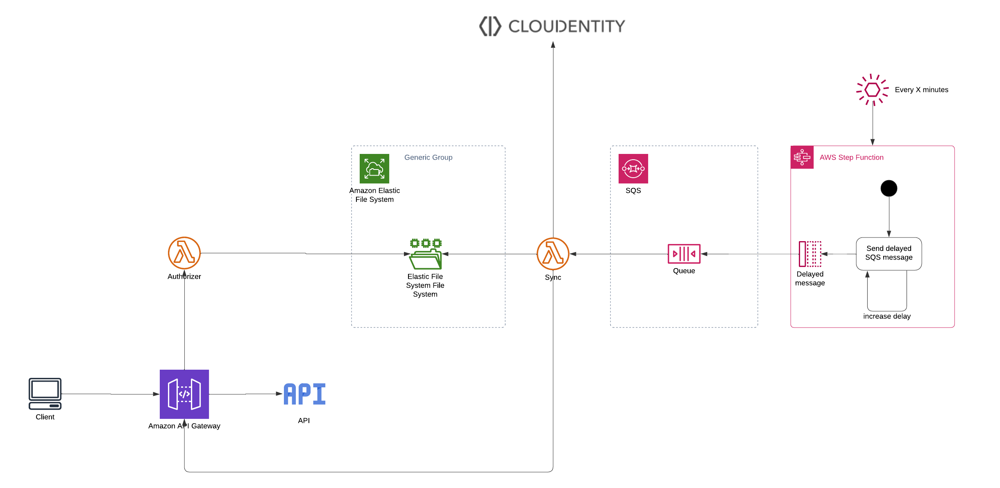

# Cloudentity AWS Authorizer CDK

This project provides CDK deployment for Cloudentity AWS Authorizer.

## Disclaimer

This repository is currently in alpha stage and is subject to change.

## Architecture



Cloudentity AWS Authorizer consists of several components.

1. The authorizer lambda function

- It's responsible for validating policies assigned to the APIs in AWS API Gateway.
- It's connecting to EFS to fetch stored configuration data from Cloudentity.

2. The sync lambda function

- It's fetching configuration from Cloudentity and stores it in EFS (the same
  File System used by the Authorizer lambda).
- Scans AWS API Gateway APIs and sends them to Cloudentity so it's possible
  to assign policies to APIs.
- Optionally, creates the Authorizer and connects it to all resources
  in selected APIs. (not recommended in prod environment)

3. Trigger mechanism

To make sure the state of configuration stored in EFS is synced with Cloudentity,
we're triggering sync lambda with a given interval.

3.1. EventBridge event

- We're creating an EventBridge rule scheduled to run every 1 minute.
- This rule triggers an AWS State Function.

  3.2. AWS State Function

- We're creating an AWS State function which pushes multiple **delayed** SQS messages
  Those messages are later responsible for triggering the sync function in intervals
  shorter than 1 minute.

  3.3. SQS Queue

- We're creating an AWS SQS Queue
- It has a Dead Letter Queue created as well

4. Simplified trigger mechanism

If there's no need to synchronize the state of configuration more often than
every 1 minute, we've added a simplified synchronization trigger option.

4.1. EventBridge event

- We're creating an EventBridge rule scheduled to run every 1 minute.
- This rule triggers the sync lambda directly.

## Prerequisites

- CDK
- Go

## Set env variables

Make sure you have required env variables set in the `.env` file

```
ACP_CLIENT_ID=xxxxx
ACP_CLIENT_SECRET=xxxx
ACP_ISSUER_URL=xxxx
```

If you're using SSO set

```
AWS_PROFILE=xxx
```

You can also set

```
CDK_DEPLOY_ACCOUNT=XXX
CDK_DEPLOY_REGION=XXX
```

if you don't set those variables, `CDK_DEFAULT_ACCOUNT` and `CDK_DEPLOY_REGION` are going to be used.

## Deploy

Run `make bootstrap` to bootstrap a new environment (only one-time per environment).
Run `make deploy` to deploy the stack using authorizer from S3.
Run `make deploy-local-files` to deploy the stack using authorizer from local `.zip` files.

### Local lambda packages (without S3)

If you have lambda `.zip` packages locally, set

```
LOCAL_LAMBDAS_DIR=xxxxx
```

to the directory where your lambdas `.zip` files are.

## IaC

By default, authorizer will get deployed with automatic authorizer creation.
It will scan all APIs and attach an authorizer to all methods in all APIs.

This is not recommended for production environments, or any environments managed using IaC tools.
To disable this behaviour, set the context parameter `-c manuallyCreateAuthorizer=true`.

This will disable automated authorizer creation.

## Demo API

If you want to deply a demo API connected to the authorizer, pass `-c deployDemo=true` context param to cdk.

You can also use a helper make target `make deploy-with-demo-api`
